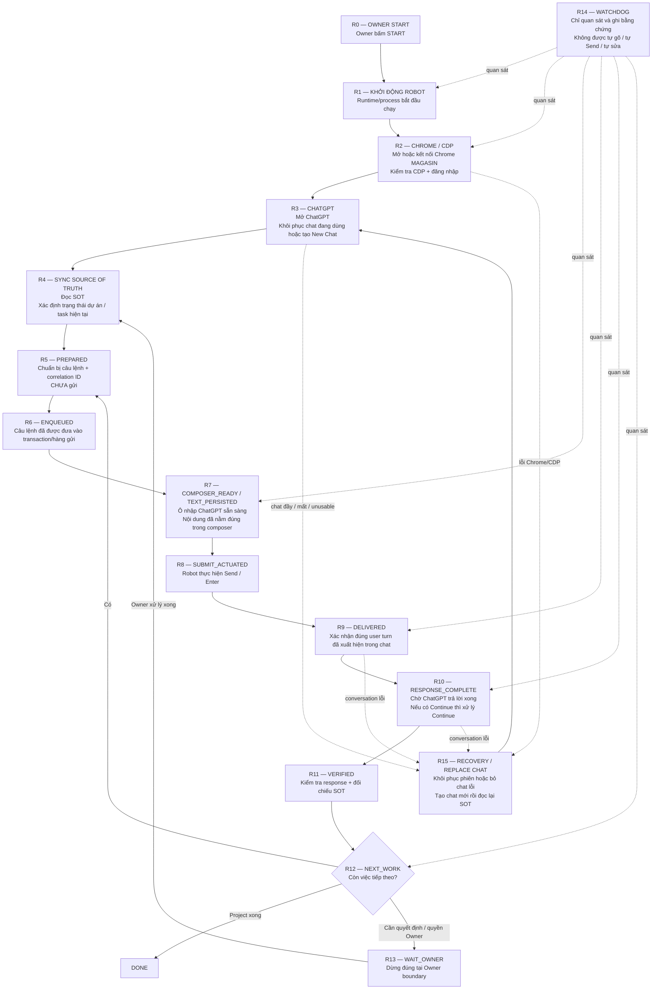
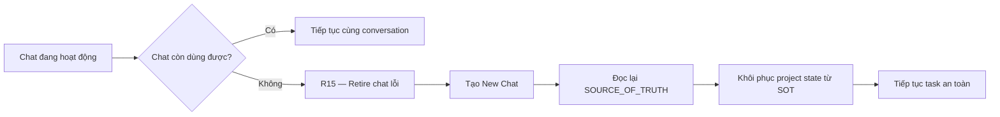

# MAGASIN Robot Workflow — Owner Guide

> Mục đích: giúp Owner không cần kiến thức kỹ thuật vẫn có thể nhìn đúng điểm Robot đang lỗi và yêu cầu sửa đúng bước.
>
> SOURCE OF TRUTH của dự án vẫn là `/SOURCE_OF_TRUTH.md`. File này chỉ là sơ đồ vận hành dễ đọc cho Owner, không thay thế SOT.

## 1. Sơ đồ tổng



## 2. Chuỗi trạng thái gửi lệnh quan trọng nhất

Đây là đoạn Owner cần nhìn khi Robot bị đứng lúc gửi yêu cầu:

```text
R5 PREPARED
   ↓
R6 ENQUEUED
   ↓
R7 COMPOSER_READY / TEXT_PERSISTED
   ↓
R8 SUBMIT_ACTUATED
   ↓
R9 DELIVERED
   ↓
R10 RESPONSE_COMPLETE
   ↓
R11 VERIFIED
   ↓
R12 NEXT_WORK
```

Nguyên tắc SC-013:

> Xác định **bước lỗi đầu tiên có bằng chứng**, chỉ sửa đúng bước đó, rồi chạy lại từ R0.  
> Không sửa nhiều bước phía sau theo phỏng đoán.

## 3. Owner nhìn triệu chứng để chỉ đúng điểm

| Triệu chứng Owner nhìn thấy | Điểm cần kiểm tra |
|---|---|
| Bấm START nhưng Robot tự tắt ngay | **R1** |
| Robot chạy nhưng Chrome không mở / CDP lỗi | **R2** |
| Chrome mở nhưng không vào ChatGPT / không tạo hoặc khôi phục chat | **R3** |
| Robot vào chat nhưng không biết task nào cần làm | **R4** |
| Robot chuẩn bị nhưng chưa thấy chữ trong ô nhập | **R5–R7** |
| **Đã có chữ trong ô nhập nhưng không gửi** | **R8** |
| Robot nghĩ đã gửi nhưng trong chat không xuất hiện câu hỏi | **R9** |
| Đã gửi nhưng Robot không chờ response / gửi tiếp quá sớm | **R10** |
| ChatGPT trả lời xong nhưng Robot không xác minh / không đi tiếp | **R11–R12** |
| Robot báo BLOCKED dù chỉ là lỗi kỹ thuật | **R12–R13** |
| Chat đầy / chat lỗi nhưng Robot không tự đổi chat | **R15** |
| Robot chết mà không có bằng chứng đang chết ở đâu | **R14** |

## 4. Cách Owner yêu cầu sửa

Thay vì nói:

> Robot lại bị lỗi, hãy sửa.

Owner chỉ cần nói theo mẫu:

```text
Lỗi R8.
Hiện chữ đã nằm trong composer nhưng Robot không Send.
Hãy kiểm tra first-failure tại R8, chỉ sửa R8, sau đó chạy lại từ R0.
```

Ví dụ khác:

```text
Lỗi R1.
Tôi bấm START nhưng Robot tự STOP trước khi mở Chrome.
Kiểm tra nguyên nhân tại R1 rồi chạy lại từ đầu.
```

Hoặc:

```text
Lỗi R12.
ChatGPT đã trả lời xong nhưng Robot không chuyển sang task tiếp theo.
Kiểm tra VERIFY -> NEXT_WORK.
```

## 5. Khi nào thực sự cần Owner

Chỉ đưa sang **R13 — WAIT_OWNER** khi có ranh giới Owner thật sự, ví dụ:

- cần đăng nhập / MFA / CAPTCHA / xác thực bảo mật;
- thiếu quyền mà Robot không thể tự cấp;
- cần Owner quyết định nghiệp vụ;
- Owner chủ động STOP;
- cần duyệt một quyết định mà SOT quy định Owner phải duyệt.

Các lỗi sau **không phải Owner block**:

- Chrome/CDP lỗi;
- ChatGPT UI thay đổi;
- composer lỗi;
- Send lỗi;
- transaction/reconciliation lỗi;
- watchdog lỗi;
- response timeout kỹ thuật;
- Robot tự STOP vì runtime bug.

Các lỗi kỹ thuật phải quay về đúng R-step để sửa.

## 6. Vai trò của Watchdog

R14 Watchdog là hệ giám sát độc lập.

Watchdog được phép:

- kiểm tra Robot còn sống hay không;
- kiểm tra runtime state;
- kiểm tra Chrome/CDP;
- xác định Robot đang đứng ở bước nào;
- ghi timestamp, fault code và bằng chứng kỹ thuật an toàn.

Watchdog **không được phép**:

- nhập chữ vào ChatGPT;
- bấm Send;
- tự retry một lệnh mơ hồ;
- thay đổi task;
- tự sửa production;
- bỏ qua exact-once safety.

## 7. Luồng phục hồi chat



Robot không được phụ thuộc vào lịch sử chat cũ để biết trạng thái dự án.

## 8. Nguyên tắc chẩn đoán SC-013

Mỗi vòng sửa production:

```text
1. PRE-ARM observer
2. START
3. Xác định first failure
4. Gắn lỗi vào đúng R-step
5. Chỉ sửa step đó
6. Chạy test
7. Deploy rõ ràng
8. Re-arm
9. Chạy lại từ R0
10. Lặp cho tới khi qua hết R12 ổn định
11. Sau đó mới soak / chạy dài hạn
```

### Ví dụ

Lần 1:

```text
R0 → R1 → R2 → R3 → R4 → R5 → R6 → R7 → X tại R8
```

=> Chỉ sửa **R8**.

Lần 2 sau khi sửa:

```text
R0 → R1 → R2 → R3 → R4 → R5 → R6 → R7 → R8 → R9 → X tại R10
```

=> R8 đã vượt qua. Lúc này mới sửa **R10**.

## 9. Mục tiêu cuối cùng

Robot đạt yêu cầu khi có thể tự chạy:

```text
Owner START
→ Robot chạy
→ Chrome khỏe
→ ChatGPT khỏe
→ đọc SOT
→ gửi đúng một lần
→ chờ đúng response
→ verify
→ next task
→ lặp nhiều cycle
→ tự thay chat khi cần
→ chỉ dừng khi thực sự cần Owner
```

---

Canonical project authority: [SOURCE_OF_TRUTH.md](./SOURCE_OF_TRUTH.md)
